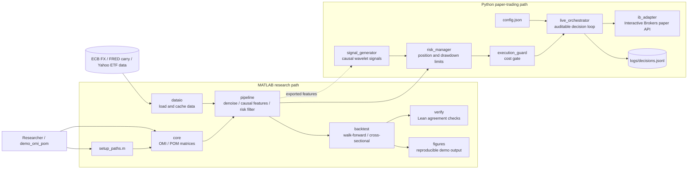

# chebyshev_wavelet_core

> High-performance MATLAB implementation of the **Operational Matrix of Integration (OMI)** and **Product Operation Matrix (POM)** for second-kind Chebyshev wavelets, with optional GPU acceleration.


**English** | [繁體中文](README_TW.md)

This module generalizes the hand-computed $16\times16$ matrix ($k=3,\ M=4$) from the reference paper into a **fully general implementation for arbitrary resolution $k$ and polynomial order $M$**, verified element-wise against the paper's Eq. (4.9) with zero error.

---

## Table of Contents

- [Theoretical Background](#theoretical-background)
- [System Requirements](#system-requirements)
- [Quick Start](#quick-start)
- [API Reference](#api-reference)
- [Numerical Verification](#numerical-verification)
- [Performance Benchmarks](#performance-benchmarks)
- [Numerical Properties & Known Limitations](#numerical-properties--known-limitations)
- [Deviations from the Original Paper](#deviations-from-the-original-paper)
- [Application Example: Paper Example 1](#application-example-paper-example-1)
- [Application Module: Financial Time-Series Denoising](#application-module-financial-time-series-denoising-wavelet_denoise_series)
- [Application Module: Causal Feature Extraction](#application-module-causal-feature-extraction-wavelet_features)
- [Application Module: Prediction & Walk-Forward Backtesting](#application-module-prediction--walk-forward-backtesting-walkforward_backtest)
- [Application Module: Cross-Sectional Long-Short Backtesting](#application-module-cross-sectional-long-short-backtesting-cross_sectional_backtest)
- [Real Data: FX](#real-data-fx-load_fx_data)
- [Real Data: Equity/Country ETFs](#real-data-equitycountry-etfs-load_etf_data)
- [Risk Filter](#risk-filter-wavelet_risk_filter)
- [System Architecture](#system-architecture)
- [Project Structure](#project-structure)
- [Citation](#citation)
- [License](#license)

---

## Theoretical Background

This implementation is based on the following paper:

> H. K. Nigam and M. M. Alam, *Convergence analysis of an efficient Chebyshev wavelet and its applications to differential equations via operational matrices of integration*, **Tamkang Journal of Mathematics**, 57(3), 171–193, 2026. DOI: [10.5556/j.tkjm.57.2026.5958](https://doi.org/10.5556/j.tkjm.57.2026.5958)

### Wavelet Definition (Paper Eqs. (2.1)–(2.3))

$$
\psi_{n,m}(t)=
\begin{cases}
2^{k/2}\,\tilde{U}_m\!\left(2^k t-2n+1\right), & \dfrac{n-1}{2^{k-1}} \le t < \dfrac{n}{2^{k-1}},\\[2mm]
0, & \text{otherwise},
\end{cases}
\qquad
\tilde{U}_m(x)=\sqrt{\tfrac{2}{\pi}}\,U_m(x)
$$

where $n=1,\dots,2^{k-1}$, $m=0,\dots,M-1$, and $U_m$ is the Chebyshev polynomial of the second kind satisfying the recurrence $U_{m+1}=2xU_m-U_{m-1}$. The weight function is rescaled and shifted to $w_n(t)=\sqrt{1-(2^kt-2n+1)^2}$, so that the basis is orthonormal in $L^2_{w_n}[0,1)$:

$$\langle \psi_{n,m},\psi_{n',m'}\rangle_{w_n}=\delta_{nn'}\delta_{mm'}$$


*The 16 basis functions for $k=3,\ M=4$. Each row corresponds to a fixed polynomial degree $m$ with 4 translates; each function is nonzero only on its own subinterval $[\frac{n-1}{4},\frac{n}{4})$, with mutually exclusive supports (dashed lines mark subinterval boundaries).*

### Operational Matrix of Integration — OMI (Paper Eq. (4.8), Thm 4.1)

$$
\int_0^t \Psi(\tau)\,d\tau \simeq P\,\Psi(t),
\qquad
P=\begin{pmatrix}
M & N & N & \cdots & N\\
O & M & N & \cdots & N\\
O & O & M & \cdots & N\\
\vdots & \vdots & \vdots & \ddots & \vdots\\
O & O & O & \cdots & M
\end{pmatrix},\qquad \hat{N}=2^{k-1}M
$$

This module derives the general formula from $\int U_m=\frac{T_{m+1}}{m+1}$ and $T_j=\frac{U_j-U_{j-2}}{2}\ (j\ge2)$:

$$
\int_{-1}^{x}U_0 = U_0+\tfrac12 U_1,
\qquad
\int_{-1}^{x}U_m=\frac{U_{m+1}-U_{m-1}}{2(m+1)}+\frac{(-1)^m}{m+1}U_0 \quad (m\ge1)
$$

$$
M(m,j)=2^{-k}g_{m,j},
\qquad
N(m,1)=\begin{cases}\dfrac{2^{-k}\cdot 2}{m+1}, & m \text{ even}\\[2mm] 0, & m \text{ odd}\end{cases}
$$

($N$ is nonzero only in the first column: once a subinterval is crossed, the integral value becomes a constant that can only be represented by the constant basis function $\psi_{n',0}$.)

### Product Operation Matrix — POM (Paper Eqs. (4.16)–(4.19))

$$F^{T}\Psi(t)\Psi^{T}(t)=\Psi^{T}(t)\tilde{F},\qquad \tilde{F}=\mathrm{blkdiag}(H_1,\dots,H_{2^{k-1}})$$

Using the linearization formula $U_lU_j=\sum_{r=0}^{\min(l,j)}U_{l+j-2r}$ and orthogonality $\int_{-1}^{1}U_aU_i\sqrt{1-x^2}\,dx=\frac{\pi}{2}\delta_{ai}$:

$$
H_n(i,j)=\alpha\sum_{l}c_{n,l}\Lambda_{i,j,l},
\qquad \alpha=2^{k/2}\sqrt{2/\pi},
$$

$$
\Lambda_{i,j,l}=\begin{cases}1, & |l-j|\le i\le l+j \ \text{and}\ i\equiv l+j \pmod 2\\ 0, & \text{otherwise}\end{cases}
$$

Since wavelet supports across different subintervals are mutually exclusive, all off-diagonal blocks of $\tilde{F}$ are identically zero.


*Left: Block upper-triangular structure of OMI $P$ ($k=3,\ M=4$), with diagonal $M$-blocks and upper-triangular $N$-blocks. Right: Block-diagonal structure of POM $\tilde{F}$ ($k=4,\ M=6$), consisting of $2^{k-1}=8$ blocks of size $6\times6$.*

---

## System Requirements

| Item | Requirement |
|---|---|
| MATLAB | **R2021a or later** (name-value syntax in `arguments` blocks) |
| Required Toolboxes | None (pure MATLAB core functions) |
| GPU Acceleration | Parallel Computing Toolbox + CUDA-compatible GPU (**optional**) |
| Memory | Default limit 24 GB, suitable for 32 GB machines; adjustable via `'MemoryLimitGB'` |

When the Parallel Computing Toolbox is not installed or no GPU is available, setting `use_gpu = true` will issue a warning and automatically fall back to CPU without interrupting execution.

## Installation

Source files live in subfolders, so add them all with the bundled helper:

```matlab
cd path/to/chebyshev_wavelet_core
setup_paths            % adds core/ pipeline/ backtest/ dataio/ demos/
setup_paths('save')    % same, but persisted via savepath
```

`setup_paths` resolves paths from its own location, so it works from any working directory. The demo bootstraps its own paths, so `demo_omi_pom` also runs without calling `setup_paths` first.

---

## Quick Start

The fastest way to get started is to run the demo script (covers construction, verification, convergence, ODE solving, and performance measurement):

```matlab
demo_omi_pom
```

Below are minimal examples for individual features:

```matlab
%% 1. Paper case k = 3, M = 4, with self-verification
[P, ~, info] = build_chebyshev_matrices(3, 4, false, [], 'Verify', true);
disp(info.verify)
%        paperEq49: 0              <- element-wise match with Eq.(4.9)
%   orthonormality: 3.3573e-16
% integrationExactness: 1.1102e-16

%% 2. Build the Product Operation Matrix (POM) for f(t) = t
E = info.expand(@(t) t);                       % Paper Eq.(5.5)
[P, Ftilde] = build_chebyshev_matrices(3, 4, false, E);

%% 3. GPU single-precision acceleration (for large matrix operations on high-frequency data)
Pg = build_chebyshev_matrices(10, 8, true, [], 'Precision', 'single');
class(Pg)      % gpuArray
A  = Pg * Pg;  % computed on GPU

%% 4. Sparse format for very large problems
[Ps, ~, is] = build_chebyshev_matrices(13, 8, false, [], 'Format', 'sparse');
fprintf('N = %d, density = %.4f\n', is.N, nnz(Ps)/is.N^2);   % N = 32768, density = 0.0313
```

---

## API Reference

```matlab
[P, Ftilde, info] = build_chebyshev_matrices(k, M, use_gpu, C, Name, Value)
```

### Positional Arguments

| Argument | Type | Default | Description |
|---|---|---|---|
| `k` | positive integer | — | Wavelet resolution; number of subintervals $L=2^{k-1}$ |
| `M` | positive integer | — | Polynomial order, $m=0,\dots,M-1$ |
| `use_gpu` | logical | `false` | Whether to construct and keep on GPU via `gpuArray` |
| `C` | double vector | `[]` | Coefficient vector of length $\hat{N}=2^{k-1}M$; POM is computed only when provided |

### Name-Value Options

| Name | Values | Default | Description |
|---|---|---|---|
| `'Format'` | `'full'` \| `'sparse'` | `'full'` | Sparse format saves ~$4M\times$ memory (see [Limitations](#numerical-properties--known-limitations)) |
| `'Precision'` | `'double'` \| `'single'` | `'double'` | Consumer GPUs have much higher FP32 than FP64 throughput; `'single'` is recommended for high-frequency data |
| `'MemoryLimitGB'` | positive number | `24` | Raises an error if exceeded to prevent out-of-memory or system paging |
| `'Verify'` | logical | `false` | Runs self-verification; results are stored in `info.verify` |

### Outputs

| Output | Description |
|---|---|
| `P` | Operational Matrix of Integration (OMI), $\hat{N}\times\hat{N}$ block upper-triangular matrix |
| `Ftilde` | Product Operation Matrix (POM), block-diagonal; returns `[]` when `C` is not provided |
| `info` | Struct with fields listed below |

`info` fields:

| Field | Description |
|---|---|
| `.N` `.L` `.k` `.M` | Matrix dimension $\hat{N}$, number of subintervals $L$, input parameters |
| `.alpha` | Scale constant $\alpha=2^{k/2}\sqrt{2/\pi}$ |
| `.Mblk` `.Nblk` | $M\times M$ diagonal / off-diagonal blocks |
| `.Lambda` | $M\times M\times M$ third-order linearization tensor $\Lambda_{i,j,l}$ |
| `.basis` | `@(t)` evaluates $\Psi(t)$, returning $\hat{N}\times$`numel(t)` |
| `.expand` | `@(fh)` projects a function onto the basis as coefficient vector $C$ (Gauss–Chebyshev quadrature) |
| `.device` `.precision` `.format` `.bytes` | Build environment and memory usage |
| `.timeOMI` `.timePOM` | Construction time for each phase (seconds) |
| `.verify` | Verification results (when `'Verify', true`) |

---

## Numerical Verification

Run with `'Verify', true`, tested on MATLAB R2026a:

| Verification Item | $k=3, M=4$ | $k=5, M=6$ |
|---|---|---|
| Element-wise match with paper Eq. (4.9) | **0** | — |
| Orthonormality $\langle\psi_i,\psi_j\rangle_w=\delta_{ij}$ | 3.36e-16 | 8.39e-16 |
| $P\Psi$ vs. closed-form $\int_0^t\Psi$ (rows with $m\le M-2$) | 1.11e-16 | 5.55e-17 |
| POM projection consistency $H_n(i,j)=\langle f\psi_j,\psi_i\rangle_w$ | 8.26e-16 | 1.62e-13 |
| POM block symmetry | 0 | 0 |

Additionally, the paper's Example 1 ($y'+2y=t,\ y(0)=0$) serves as an end-to-end validation: this module yields $c_{1,0}=0.003866313244751$, matching the paper's printed value `0.00386631324475085`; $\max|y_{\text{num}}-y_{\text{exact}}|=9.94\times10^{-6}$.

### Convergence Order

With $M=4$ fixed, refining the resolution from $k=1,\dots,7$ to approximate $f(t)=e^{t}\sin(4t)$:


The measured $L^2$ error decreases monotonically from $7.9\times10^{-2}$ to $4.6\times10^{-9}$, dropping by a factor of $2^{4.00}$ per increment of $k$, consistent with the theoretical slope $\hat{N}^{-M}$ (gray dashed line; the two lines are nearly indistinguishable).

| $k$ | 1 | 2 | 3 | 4 | 5 | 6 | 7 |
|---|---|---|---|---|---|---|---|
| $\hat{N}$ | 4 | 8 | 16 | 32 | 64 | 128 | 256 |
| $L^2$ error | 7.93e-02 | 5.04e-03 | 3.03e-04 | 1.90e-05 | 1.19e-06 | 7.43e-08 | 4.65e-09 |
| Convergence order | — | 3.98 | 4.05 | 4.00 | 4.00 | 4.00 | 4.00 |

The reference values for verification item (c) use the **closed-form antiderivative** $\int_{-1}^{x}U_m=\frac{T_{m+1}(x)-T_{m+1}(-1)}{m+1}$ rather than numerical quadrature — the wavelets are discontinuous at subinterval boundaries, and the trapezoidal rule introduces $O(h)$ errors at jumps (empirically ~2.3e-3 false positives).

---

## Performance Benchmarks

Test environment: Intel Core i7-13620H (10 threads) / 32 GB RAM / NVIDIA RTX 4060 Laptop GPU (8 GB) / MATLAB R2026a.
Workload is $P \times X$ ($X$ is a dense data matrix of the same size), measured via `timeit` / `gputimeit`.

**⚠️ Important Note on CPU Numbers**

Empirical testing revealed that **CPU-side BLAS throughput can vary ~6× across different MATLAB processes** (single-precision: 78 → 531 GFLOPS), likely due to MKL thread pool warm-up state: freshly launched `matlab -batch` processes run slower, while processes that have already performed heavy computation approach hardware peak. Therefore, CPU columns below are presented as **observed ranges**, while GPU columns are stable and reproducible. **Do not treat any single speedup ratio as a performance guarantee — always run `demo_omi_pom` on your own hardware.**

| Precision | $\hat{N}$ | GPU Time | GPU Throughput | CPU Throughput (observed range) | Speedup Range | CPU/GPU Discrepancy |
|---|---|---|---|---|---|---|
| double | 4096 | 0.85 s | 161 GFLOPS | 38 – 264 GFLOPS | **0.6× – 4.2×** | 1.1e-15 |
| single | 4096 | 0.026 s | ~5300 GFLOPS | 78 – 531 GFLOPS | **10× – 68×** | 6.0e-07 |
| single | 8192 | 0.20 s | ~5500 GFLOPS | 87 – 117 GFLOPS | **49× – 63×** | 8.6e-07 |

The measured GPU throughput ratio FP32:FP64 $\approx$ 5300:161 $\approx$ 33:1, consistent with the GeForce architecture specification where FP64 throughput is 1/64 of FP32 (including memory bandwidth effects). Key takeaways:

- **GPU may not outperform CPU at double precision** — when the CPU is in a warm state, the GPU can actually be slower (0.6×). If your computation is sensitive to rounding errors (e.g., solving ill-conditioned linear systems), keep `double` and stay on CPU.
- **Single precision is the GPU's sweet spot**, delivering over an order of magnitude speedup; the trade-off is ~$10^{-7}$ relative error.

> **Measurement pitfall**: Directly timing `P*P` yields unreliable results. $P$ has ~97% zero entries, and MATLAB's `zeros()` uses lazy memory page allocation. Force materialization with `P = P + 0;` first, and use a representative dense workload (e.g., $P \times X$). Section 7 of `demo_omi_pom.m` already follows this practice.

**Construction Time & Memory:**

| Setting | $\hat{N}$ | Format | nnz | Memory | Build Time |
|---|---|---|---|---|---|
| $k=10,M=8$ | 4096 | full | — | 0.12 GB | ~0.1 s |
| $k=11,M=8$ | 8192 | full | — | 0.50 GB | ~0.3 s |
| $k=13,M=8$ | 32768 | sparse | 3.36e7 | 0.50 GB | ~0.5 s |
| $k=15,M=8$ | 131072 | sparse | 5.37e8 | 8.20 GB | ~12 s |

(Build times are approximate and subject to process state; memory and nnz values are exact.)

---

## Numerical Properties & Known Limitations

### 1. Basis Truncation (Inherent Property of the Method)

Every element of $P$ and $\tilde{F}$ is an **orthogonal projection coefficient** in $L^2_{w_n}$, exact up to rounding; however, the basis is truncated at $m=M-1$:

- **OMI**: $\int\psi_{n,m}$ contains a $U_{m+1}$ term, so rows with $m\le M-2$ are reproduced **exactly**, while the row $m=M-1$ (the last row of each block) is a best-approximation projection with error $O(2^{-k}/(2M))$. This is the standard approach in the paper.
- **POM**: The product of two polynomials of degree $M-1$ has degree $2M-2$; projecting back to the $M$-dimensional subspace necessarily discards higher-order components. Thus $\Psi^T\tilde{F}$ only approximates $F^T\Psi\Psi^T$ in the $L^2_w$ sense (pointwise residual ~0.33 for $k=3, M=4$). **Increasing $k$ (refining subintervals) is more effective than increasing $M$ for reducing this error.**

### 2. Sparse Format Is Not $O(N)$

The off-diagonal block $N$ repeats in every right-side block column, so

$$\mathrm{nnz}(P)\approx\frac{L^2}{2}\left\lceil \frac{M}{2}\right\rceil=\frac{\hat{N}^2}{4M}$$

The density approaches $1/(4M)$ (measured 0.0313 for $M=8$). The sparse format only saves ~$4M\times$ memory and **does not change the $O(N^2)$ asymptotic behavior**. The `'MemoryLimitGB'` estimate uses this formula (measured vs. actual allocation error < 1%).

### 3. Other Notes

- Sparse matrices in MATLAB are always double-precision, so `'Format','sparse'` ignores the `'Precision'` setting and issues a warning.
- `'Format','sparse'` does not transfer to GPU (`gpuArray` has limited sparse matrix support).
- When $M=1$, all rows are affected by truncation; `info.verify.integrationExactness` returns `NaN`.

---

## Deviations from the Original Paper

The paper's **general formulas** Eqs. (4.11)/(4.12) are inconsistent with its **explicit** $16\times16$ matrix in Eq. (4.9): the general formula yields $\pm\frac{2}{(m-1)(m+1)}$-type coefficients (e.g., $\frac{2}{15}$), while the actual values in Eq. (4.9) are of the $\frac{2^{-k}}{m+1}$ type.

This module re-derives from first principles, and the resulting $M$ and $N$ blocks **match Eq. (4.9) element-wise with zero error**, further confirmed by orthogonal projection checks (error $\sim10^{-16}$). We therefore conclude that the general formulas in the paper contain typographic errors, and the implementation follows the version consistent with Eq. (4.9).

---

## Application Example: Paper Example 1

Solving the first-order linear IVP $y'(t)+2y(t)=t,\ y(0)=0$, with exact solution $y=\frac{t}{2}-\frac14+\frac14 e^{-2t}$.

Let $y'(t)=C^T\Psi(t)$, integrate both sides from 0, apply the initial condition and $t=E^T\Psi(t)$, then by Eq. (4.8):

$$(I+2P^T)C=P^TE$$

```matlab
[P, ~, info] = build_chebyshev_matrices(3, 4);

E  = info.expand(@(t) t);                         % Paper Eq.(5.5)
C  = (eye(info.N) + 2*P.') \ (P.'*E);             % Paper Eq.(5.7)
y  = @(t) (C.' * info.basis(t)).';                % y(t) = C^T \Psi(t)

tt = linspace(0, 1, 201).';
err = max(abs(y(tt) - (tt/2 - 1/4 + exp(-2*tt)/4)));
fprintf('max error = %.3e\n', err);               % max error = 9.942e-06
```


*Top: The wavelet solution and exact solution for $k=3,\ M=4$ are nearly indistinguishable. Bottom: Absolute error as $k$ is refined with $M=4$ fixed — maximum errors for $k=3\to6$ are 9.94e-06, 7.02e-07, 4.67e-08, 3.01e-09, respectively.*

### Variable-Coefficient ODE: Practical Use of POM

$$y'(t)+t\,y(t)=t,\qquad y(0)=0,\qquad \text{exact solution } y=1-e^{-t^2/2}$$

Let $y'=C^T\Psi$, then $y=(P^TC)^T\Psi=:D^T\Psi$. The variable-coefficient term is handled via POM: $a(t)y(t)=(A^T\Psi)(\Psi^TD)=\Psi^T\tilde{A}D$, yielding

$$(I+\tilde{A}P^T)\,C=G$$

```matlab
[Pv, ~, iv] = build_chebyshev_matrices(7, 6);
Av = iv.expand(@(t) t);                    % a(t) = t
Gv = iv.expand(@(t) t);                    % g(t) = t
[~, Atl]    = build_chebyshev_matrices(7, 6, false, Av);

Cv = (eye(iv.N) + Atl*Pv.') \ Gv;          % coefficients of y'
Dv = Pv.' * Cv;                            % coefficients of y (y(0)=0)
```


*At $k=7,\ M=6$, the maximum error is $5.2\times10^{-16}$, reaching machine precision. Errors for $k=3/5/7$ are 8.20e-09, 2.11e-12, 5.18e-16, respectively.*

---

## Application Module: Financial Time-Series Denoising `wavelet_denoise_series`

The first step in the data processing pipeline: project a 1D (or multi-series 2D) time series into the wavelet space, filter out high-frequency noise, and simultaneously output the first derivative as a trend-strength feature.

```matlab
[S_smooth, dS_dt, C, diagOut] = wavelet_denoise_series(S, T, k, M, Name, Value)
```

### Three Core Mechanisms

**1. Projection**: After normalizing the time axis to $\tau\in[0,1]$, inner products are computed via Gauss–Chebyshev quadrature. Since each basis function has exclusive support on its subinterval, projection can be performed block-independently, reducing the entire operation to a single matrix multiplication $(M\times Q)(Q\times L\cdot n_{\text{series}})$ — no block or asset loops required.

**2. Denoising**: The primary source of smoothing is **dimensionality reduction itself** ($\hat{N}=2^{k-1}M \ll n_{\text{obs}}$). Two additional mechanisms are available and can be combined: degree truncation via `'KeepDegree'` and coefficient thresholding via `'Threshold'`.

**3. First Derivative**: Differentiation reduces a degree-$m$ polynomial to degree $m-1$, which remains within the same wavelet space. Thus there exists an **exact** block-diagonal differentiation matrix $D$ satisfying $\frac{d}{dt}\Psi(t)=D\,\Psi(t)$. From $U'_m = 2\sum_{j=m-1,m-3,\dots}(j+1)U_j$:

$$D_{m,j} = 2^{k}\cdot 2(j+1),\qquad j = m-1,\, m-3,\, \dots$$

This approach **does not invert the OMI**: since the last row of each block in $P$ has already dropped the $U_M$ term, matrix inversion would amplify this truncation error along with residual noise. Consistency between $D$ and the OMI can be verified via the identity obtained by differentiating $\int_0^t\Psi = P\Psi$:

$$P\,D = I$$

Empirically, the error on rows with $m\le M-2$ of each block is **0** (machine precision); only the $m=M-1$ row deviates by exactly 1.0 — precisely the $U_M$ term dropped by $P$. This serves as a cross-validation of mathematical consistency between the two modules.

### Empirical Benchmarks

Simulated price (sine + random walk + Gaussian noise, $n=750$, noise std 1.2), average RMSE over 30 random trials:

| Method | RMSE vs. True Signal |
|---|---|
| **k=4, M=4 pure projection** | **0.284** |
| Savitzky–Golay (3, 41) | 0.292 |
| movmean(21) | 0.325 |
| k=5, M=4, `KeepDegree=2` | 0.330 |
| k=6, M=4, `Threshold='auto'` (hard) | 0.478 |
| Raw noisy data | 1.197 |

Derivative as a trend feature: at $k=4$, the correlation with the true derivative reaches **0.996**, while finite-differencing the noisy data directly yields only 0.122.


*Top: Denoised result and true signal are nearly indistinguishable. Middle: Residuals show no structure, indicating a good fit. Bottom: The derivative accurately tracks the true trend, but exhibits visible jumps at subinterval boundaries (dashed lines).*

### Two Limitations You Must Know

**Thresholding does not outperform pure projection for this type of data** (see table above). The reason is that this basis is a **piecewise polynomial regression basis**, where noise energy is distributed across all polynomial degrees rather than being sparsely concentrated as in traditional multi-resolution wavelets — the Donoho–Johnstone sparsity assumption does not hold. This option is disabled by default and is reserved for scenarios where noise is genuinely sparse or contains impulses. **Prioritize adjusting $k$**; a good starting heuristic is ~100 data points per subinterval, i.e., $k \approx \log_2(n_{\text{obs}}/100)+1$.

**Subinterval boundary discontinuities**: Each $\psi_{n,m}$ has exclusive support with no junction conditions imposed, so the reconstructed series will have jumps at $L-1$ boundary points. Even with optimal parameters, these reach 15–20% of std(S) in practice (clearly visible in the third panel above), exceeding 30% when $k$ is too large (a warning is issued in this case). `diagOut.maxBlockJumpRel` reports this metric. If downstream strategies are sensitive to derivative spikes near boundaries, apply masking or use a smoother with continuity constraints.

### Additional Features

Supports `datetime` / `duration` time axes (derivatives are automatically in per-day units), automatic NaN interpolation, non-uniform sampling, and $n_{\text{obs}}\times n_{\text{series}}$ multi-asset matrix input (multi-asset vs. per-asset loop results differ by $4.3\times10^{-14}$). For full parameter documentation, run `help wavelet_denoise_series`.

---

## Application Module: Causal Feature Extraction `wavelet_features`

The second step in the data processing pipeline — the essential bridge to prediction models.

```matlab
[F, featNames, causal, diagOut] = wavelet_features(S, T, Name, Value)
```

### Why This Step Is Necessary

`wavelet_denoise_series` projects the entire series at once, so the smoothed value at time $t$ uses data **after** $t$. This is perfectly fine for post-hoc analysis and plotting, but feeding it to a prediction model constitutes textbook look-ahead bias. This module instead uses a rolling window, ensuring that the features at time $t$ use only $S(1..t)$.

This is not a theoretical concern. We test on a **pure geometric random walk** for next-day direction prediction (ridge regression, first 70% for training, last 30% out-of-sample, 40 independent experiments) — a random walk has no predictability, so out-of-sample accuracy significantly above 0.5 can only come from data leakage:

| Feature Source | OOS Accuracy | Distance from 0.5 |
|---|---|---|
| **This module (causal)** | **0.5007 ± 0.0038** | **+0.2 SE** |
| Batch denoised slope | 0.5341 ± 0.0041 | +8.3 SE |
| Batch smoothed value − close price | 0.5630 ± 0.0033 | +18.8 SE |
| Both of the above combined | 0.5748 ± 0.0034 | +22.3 SE |

Non-causal features can inflate out-of-sample accuracy by up to **7.5 percentage points** on data with zero signal. Reverse validation: on a series with real periodic components, this module's features achieve OOS accuracy of **0.7066 ± 0.0042** (majority-class baseline 0.5197) — no fabricated signal when there is none, but captures signal when it exists.


*Top: The batch smoother (red) uses future data — the curve is smooth but unusable for modeling; the causal smoother (blue) uses only past data and necessarily reacts later. Bottom: Direction accuracy on a random walk — everything above the dashed line is leakage.*

### Design Rationale (Two Empirical Studies)

**Default `Weighting='uniform'`**: The paper's weight function $w=\sqrt{1-x^2}$ vanishes at $x=\pm1$, which pushes the weight of the most recent observation to near zero — undesirable for causal features. Empirically, the estimation error at the right edge of the window is ~25% lower with uniform least squares than with weighted projection:

| $W=63,\ M=4$ | Right-edge Value RMSE | Right-edge Slope RMSE |
|---|---|---|
| uniform | **0.0449** | **0.819** |
| chebyshev | 0.0642 | 0.924 |

**Default `k=1`**: Since this basis has mutually exclusive supports, for $k\ge2$ the value and slope at the right edge of the window depend **only on the last subinterval's $W/2^{k-1}$ points** — empirically, altering the first half of the window changes the right-edge features by exactly **0**. This makes $W$ and $k$ cancel each other for right-edge features, so multi-scale information is instead provided via multiple **window lengths** `'Windows'`.

### Feature Set

Each window length produces 6 dimensionless features (default `Windows = [21 63 252]`, yielding 18 features total):

| Feature | Definition | Interpretation |
|---|---|---|
| `trend` | $\dfrac{dS/d\tau}{S}$ | Relative change over one window length |
| `trendT` | $\dfrac{dS/d\tau}{\sigma_{\text{res}}}$ | Trend strength normalized by residual std (t-statistic analogue) |
| `curv` | $\dfrac{d^2S/d\tau^2}{S}$ | Curvature / acceleration — detects trend reversals |
| `dev` | $\dfrac{S(t)-\hat{S}(t)}{\sigma_{\text{res}}}$ | Standardized deviation (mean-reversion signal) |
| `vol` | $\dfrac{\sigma_{\text{res}}}{S}$ | Within-window relative volatility |
| `rough` | $\dfrac{\sum_{m\ge2}E_m}{\sum_{m\ge1}E_m}$ | Energy share of higher-order coefficients (nonlinearity of trend) |

Derivatives are likewise computed via the block-diagonal differentiation matrix $D$; the second derivative is obtained by applying $D$ twice: $\frac{d^2S}{d\tau^2}=\Psi^{T}(D^{T})^{2}C$. Independent point-by-point recomputation confirms that smoothed values, `trend`, and `curv` agree to within $10^{-13}$.

### Alignment with Prediction Targets

```matlab
[F, names] = wavelet_features(S, T);
y   = [sign(diff(S)); NaN];        % y(t) = next-period direction
ok  = all(isfinite(F), 2) & isfinite(y);
Xtr = F(ok, :);   ytr = y(ok);
```

**Do NOT shift `F` forward to "align" with labels** — that directly creates look-ahead bias. Train/test splits must follow temporal order (walk-forward), never random splits.

Setting `'Verify', true` runs a causality self-check: after perturbing future data, past features must remain completely unchanged (`diagOut.leakTest` should be 0; otherwise an error is raised).

### Performance

When the window length is fixed and observations are equally spaced, the projection operator is identical for every window. The operator is constructed once as an $(N\times W)$ linear map and applied to all windows via a single matrix multiplication — the time axis is fully vectorized. Empirically, 20 assets × 1500 observations × 18 features takes ~0.27 seconds; multi-asset vs. per-asset loop results differ by $3.5\times10^{-13}$.

---

## Application Module: Prediction & Walk-Forward Backtesting `walkforward_backtest`

The third step in the data processing pipeline. Periodically retrains using a walk-forward scheme, generates predictions only on unseen segments, and includes built-in null-hypothesis testing to determine whether performance is merely due to chance. No toolbox dependencies (ridge is computed in closed form; logistic regression is implemented via IRLS).

```matlab
F   = wavelet_features(S, T);
res = walkforward_backtest(F, S, 'NullRuns', 200, 'CostBps', 5);
fprintf('Accuracy %.4f (p = %.3f) | Sharpe %.2f (p = %.3f)\n', ...
    res.accuracy, res.null.pAccuracy, res.sharpe, res.null.pSharpe);
```

### How the Framework Prevents Data Leakage

1. **Temporal splits**: The training set always precedes the test set — never random splits.
2. **Normalization uses training-set statistics only**: At each retraining, features are standardized using the training set's mean and standard deviation.
3. **Hyperparameters use training set only**: The test segment is completely excluded from selection.
4. **Label alignment**: Features at time $t$ predict the return from $t$ to $t+1$; the position is established at $t$ and settled at $t+1$.
5. **Embargo period**: A gap can be left between the training set end and the test segment start (default: 1 period).

Two empirical validations: altering data **after** the test segment changes **0 / 489** prior predictions; scaling test-segment features by 50× changes **0** prior predictions (confirming no use of full-sample statistics).

### Null-Hypothesis Testing & Calibration

The backtesting framework itself could produce spurious performance through multiple comparisons or implementation artifacts, so this module includes a built-in null distribution: features are kept fixed while return sequences are reshuffled to break the feature–label correspondence, and the same procedure is rerun.

**Calibration must be verified** — a poorly calibrated significance test is worse than no test at all. On 40 pure random walks (no predictability, so p-values should theoretically be uniformly distributed), each with 150 null samples:

| | $P(p<0.05)$ | $P(p<0.10)$ | $P(p<0.20)$ | KS |
|---|---|---|---|---|
| Nominal | 0.05 | 0.10 | 0.20 | — |
| `shift` Accuracy | 0.050 | 0.075 | 0.250 | 0.100 |
| `shift` Sharpe | 0.025 | 0.175 | 0.275 | 0.163 |
| **`block` Accuracy** | 0.000 | 0.025 | 0.175 | 0.141 |
| **`block` Sharpe** | 0.025 | **0.050** | **0.200** | **0.072** |

The `block` method (block bootstrap, default) yields nearly uniform Sharpe p-values, while accuracy p-values are slightly conservative. The `shift` method (circular shift) produces optimistic Sharpe p-values at the 10% level. Since Sharpe is the practical decision criterion, `block` is the default.

### Why the Default Uses a Fixed λ

During development, the original "internal validation to select λ" approach was found to break the above calibration. Two pieces of evidence:

**λ barely affects performance** — scanning across six orders of magnitude, the out-of-sample accuracy on signal-bearing data varies only from 0.7048 to 0.7119, and the internally selected values are scattered across the entire grid, effectively random.

**λ selection systematically deflates p-values** — on the same 40 random walks, the only difference being whether λ is selected:

| | $P(p<0.05)$ Accuracy | $P(p<0.05)$ Sharpe |
|---|---|---|
| Internal validation for λ | 0.100 | 0.125 |
| **Fixed λ = 1** | **0.050** | **0.025** |

The reason is that null samples inherit hyperparameters tuned on the real labels, giving the null model a systematic disadvantage. If the user still provides a λ vector, this module re-selects λ using the permuted labels within each null sample to maintain symmetry, but at significantly increased computational cost.


*Left: On a random walk, strategy Sharpe is 0.46 with $p=0.059$; the observed value falls within the null distribution and underperforms buy-and-hold. Right: With a real signal, the observed value is far outside the null distribution. Any single result has ~5% chance of being spuriously significant; the framework's credibility rests on the calibration table above, not on any individual result.*

### Detection Power: How Weak a Signal Can This Framework Detect?

Tested on synthetic series with AR(1) returns ($n=2500$, 12 replicates, 120 null samples each). $\phi$ is the autocorrelation of daily returns:

| $\phi$ | Accuracy | Strategy Sharpe | Buy-and-Hold Sharpe | Median p | Power |
|---|---|---|---|---|---|
| 0 | 0.5011 | 0.078 | 0.446 | 0.467 | **0.00** |
| 0.05 | 0.4973 | 0.172 | 0.368 | 0.512 | 0.17 |
| 0.10 | 0.5118 | 0.298 | 0.315 | 0.421 | 0.25 |
| 0.20 | 0.5359 | **1.487** | 0.602 | 0.012 | **0.83** |

Two conclusions you must accept:

1. **A signal of $\phi \approx 0.20$ is needed for reliable detection** (power 0.83); at $\phi=0.05$, power is only 0.17. Real stock daily return autocorrelation is typically 0.00–0.05, **falling in the undetectable range of this framework**.
2. **For $\phi \le 0.10$, the strategy Sharpe consistently underperforms buy-and-hold**; it only truly wins at $\phi=0.20$.

This is a statistical limitation at this sample size for a single series, not an implementation flaw. Paths to improvement include longer histories, more predictive features, or a cross-sectional approach (accumulating evidence across hundreds of assets simultaneously) — not repeatedly tuning parameters on the same series, which only increases overfitting risk.

### A Common Trap

**On price series with drift, both "accuracy" and "Sharpe" reward being simply long.** Empirically, when λ is extremely large, the model degenerates to always predicting the majority class, achieving accuracy 0.5106 and Sharpe 0.396 — seemingly skillful but effectively equivalent to buy-and-hold. Therefore, the correct benchmark is not 0.5 but the majority-class and buy-and-hold performance simultaneously reported in `res.baseline`. The left panel above is exactly this case: strategy Sharpe of 0.46 appears positive, but buy-and-hold is higher over the same period.

---

## Application Module: Cross-Sectional Long-Short Backtesting `cross_sectional_backtest`

The fourth step in the pipeline, addressing directly the limitation identified by the power analysis in step three.

```matlab
F   = wavelet_features(S, T);                 % S is an nObs x nAssets price matrix
res = cross_sectional_backtest(F, S, 'NullRuns', 200, 'CostBps', 5);
fprintf('IC %.4f (ICIR %.2f, p = %.3f) | Sharpe %.2f\n', ...
    res.meanIC, res.icir, res.null.pIC, res.sharpe);
```

### Why Cross-Sectional Breaks the Single-Series Limit

The power analysis of `walkforward_backtest` showed that a single series at $n=2500$ requires $\phi \approx 0.20$ to be detectable, while real stocks exhibit only 0.00–0.05. The cross-sectional approach improves this on two fronts:

1. **Sample size**: each date contributes $n_{\text{assets}}$ samples, so training samples grow from $O(T)$ to $O(T \times n_{\text{assets}})$ (measured: 200 assets × 2000 periods yields 348k samples), shrinking the standard error by roughly $\sqrt{n_{\text{assets}}}$.
2. **Removing the common factor**: cross-sectional standardization subtracts the day's market component. Single-series timing must predict market direction (very hard); the cross-sectional approach only needs to predict **relative ranking**.

**Head-to-head comparison on identical data** (120 assets with an injected $\kappa=0.05$ cross-sectional reversal signal):

| Method | Metrics | p-value |
|---|---|---|
| **Cross-sectional long-short** | IC +0.0947, Sharpe 14.38 | **0.010** |
| Single-series timing (6-asset average) | Accuracy 0.5165, Sharpe 0.54 | 0.109 (not significant) |
| Equal-weight buy-and-hold | Sharpe 0.38 | — |

The same signal is detected cross-sectionally but missed by single-series timing.


*Left: long-short equity far exceeds equal-weight buy-and-hold. Right: distribution of daily rank IC, mean 0.097 with a 0.84 hit rate.*

> **These Sharpe figures must not be taken as live-trading expectations.** This section uses entirely synthetic data with an injected signal far stronger than real markets, and excludes borrowing costs, liquidity, and market impact. Their only purpose is to demonstrate that the framework detects what it should detect. In practice, a monthly IC of 0.02–0.05 already constitutes a usable signal.

### Causality and Method

- **Target**: next-period return, cross-sectionally demeaned and divided by that day's cross-sectional standard deviation, so that all dates are on a comparable scale.
- **Feature standardization**: performed *within each date, across assets* (`rank` or `zscore`). This uses only same-day data and involves **no time-series statistics, so it introduces no look-ahead bias** — although it uses information from other assets, all of that information is known at the time.
- **Model**: ridge regression on pooled (asset, time) samples, with train/test split by time.
- **Evaluation**: primarily the information coefficient (IC), the rank correlation between predicted scores and realized relative returns; its advantage is independence from portfolio construction. ICIR, IC t-statistic, and hit rate are also reported.

Leakage check: after perturbing data *after* the test segment, the maximum change in prior prediction scores was **0.000e+00 across 56,040 entries**.

### Null-Test Calibration (Please Read)

Verified on synthetic panels with *no* cross-sectional signal (where p-values should theoretically be uniform), 50 replications × 100 null samples:

| | `P(p<0.05)` | `P(p<0.10)` | `P(p<0.20)` | KS | Mean |
|---|---|---|---|---|---|
| Nominal | 0.05 | 0.10 | 0.20 | — | 0.50 |
| `date` IC | 0.080 | 0.140 | 0.200 | 0.097 | 0.472 |
| `date` Sharpe | 0.040 | 0.160 | 0.220 | 0.073 | 0.486 |
| `asset` IC | 0.100 | 0.140 | 0.200 | 0.087 | 0.475 |
| `asset` Sharpe | 0.040 | 0.120 | 0.280 | 0.102 | 0.479 |

Observed IC was $+0.00031 \pm 0.00062$ — effectively zero, confirming no fabricated signal. The overall distribution is close to uniform (all KS statistics pass against the 0.192 critical value; mean p ≈ 0.48), **but the extreme left tail of the IC p-value is mildly heavy**: pooling an additional independent set of 30 replications (80 no-signal panels in total), the IC `P(p<0.05)` is approximately 0.10, twice the nominal rate (about 2 standard errors); the Sharpe figure remains within noise.

**Recommendation: treat an IC p-value near 0.05 as marginal rather than conclusive.** Use a stricter threshold (e.g. 0.01), or require both the IC and Sharpe p-values to be significant. Three rounds of investigation (including switching to the global asset permutation `'asset'` mode) found the calibration difference between the two modes to be within the standard error, and identified no correctable mechanism — hence this is disclosed rather than hidden.

### Performance

The projection operator and each fold's $X^TX$ are unchanged under permutation, so the Cholesky factorization is computed once and reused; tied ranking and within-date permutation are both vectorized. Measured on 200 assets × 2000 periods × 18 features (idle machine): 1.4 s per backtest, and about 0.74 s per null run (roughly 2.5 minutes for 200 runs). Null-run cost scales with the number of assets and test dates, and is sensitive to CPU contention — the same measurement taken while another MATLAB process was running gave 1.67 s.

---

## Real Data: FX `load_fx_data`

Everything above uses synthetic data. This module connects the pipeline to a real market: **European Central Bank daily reference rates**, via the [Frankfurter API](https://api.frankfurter.dev) (free, no API key, no rate limit, coverage from 1999-01-04). Data is cached locally after the first fetch.

```matlab
[S, T, names] = load_fx_data();               % 7086 days x 9 G10 currencies
F   = wavelet_features(S, T, 'Windows', [21 63 252]);
res = cross_sectional_backtest(F, S, 'NullRuns', 200, 'CostBps', 2, ...
                               'MinAssets', 6, 'Quantile', 1/3);
```

### Numeraire Conversion (the module's core design)

The ECB publishes only EUR-based rates. Laying those series side by side for cross-sectional analysis would mean every series shares the EUR leg, so the ranking would be dominated by EUR strength. This module therefore converts to a single numeraire (USD by default):

$$S_X(t) = \frac{\text{(numeraire per EUR)}(t)}{\text{(X per EUR)}(t)}$$

i.e. the value of one unit of currency $X$. Verified against the ECB source rates with **0.000e+00** conversion error for EURUSD, USDJPY, and GBPUSD.

After conversion the shared component becomes the *dollar* factor: the measured average off-diagonal correlation of daily returns is **0.512**. `cross_sectional_backtest`'s cross-sectional demeaning removes exactly this common component, leaving relative currency strength — which is precisely the input the cross-sectional module needs.

### Two Things You Must Know Before Using It

**Spot rates are not total returns.** FX total return = spot change + interest-rate differential (carry). ECB reference rates contain **no carry**. For FX, carry is often the dominant component and can drive the entire P&L of a long-short strategy. Any Sharpe computed here is a *spot-only* figure, not an achievable trading return. To evaluate a tradeable strategy you must add short-rate differentials (e.g. OIS) for each currency.

**These are fixing prices, not tradeable quotes.** ECB reference rates are set around 16:00 CET; they are not close prices and carry no bid-ask information. Real execution costs must be added via `'CostBps'`.

### Measured Result: No Tradeable Signal Found

Full sample, 6334 out-of-sample days, 200 null runs:

| Metric | 0 bps | 2 bps |
|---|---|---|
| Mean rank IC | −0.0003 (ICIR −0.00, t = −0.06, p = 0.512) | same |
| Sharpe | −0.15 (p = 0.796) | **−0.94** (p = 0.557) |
| IC hit rate | 0.495 | 0.495 |
| Turnover | 1.03 / day | 1.03 / day |
| Equal-weight G10 basket | Sharpe +0.16 | — |


*Top-left: the nine G10 currencies valued in USD. Top-right: the strategy loses steadily while the passive basket does not. Bottom-left: the observed IC sits squarely inside the null distribution. Bottom-right: 252-day rolling IC swings between −0.25 and +0.22 and is positive only 46.3% of the time — no stable signal.*

Single-currency timing agrees: EUR/JPY/GBP accuracies were 0.5093 / 0.5044 / 0.4976, all with non-significant p-values — consistent with the power analysis, which predicted that real FX autocorrelation is too weak to detect at this sample size.

Note also that turnover of 1.03/day means the portfolio is rebuilt almost completely every day, costing about **5.2% per year at 2 bps**. That alone would erase any signal of realistic magnitude.

### A Sub-Period Result That Looks Significant — and Why It Is Not

Splitting the sample in half produced this:

| Period | IC | p(IC) | Sharpe | p(Sharpe) |
|---|---|---|---|---|
| 1999–2012 | −0.0020 | 0.616 | −0.94 | 0.636 |
| 2013–2026 | **+0.0123** | **0.026** | −0.82 | 0.291 |

A p-value of 0.026 looks like a discovery. It is not, for three independent reasons:

1. **Multiple comparisons.** Two sub-periods were tested, so the Bonferroni-adjusted threshold is 0.025 — this fails even that minimal correction.
2. **The documented calibration.** As measured in the [null-test calibration](#null-test-calibration-please-read), this module's IC p-value has a mildly heavy left tail: `P(p<0.05)` ≈ 0.10, roughly twice nominal. A nominal 0.026 therefore corresponds to something closer to 0.05 in truth.
3. **Internal inconsistency.** The IC is positive while the Sharpe over the same period is **negative** (−0.82, p = 0.291). A ranking that is "correct" yet loses money is not a tradeable signal. This repo's own stated rule — require both the IC and Sharpe p-values to be significant — rejects it.

This is exactly the kind of false positive the guardrails were built to catch, which is why it is documented rather than reported as a finding.

### Adding Carry: `load_fx_carry` and `'ReturnType','total'`

Since FX total return = spot change + interest-rate differential, a spot-only backtest is incomplete. `load_fx_carry` fetches OECD 3-month interbank rates for all G10 currencies from FRED (free, no key), and `load_fx_data('ReturnType','total')` builds a total-return index:

$$\mathrm{TRI}_X(t) = \mathrm{TRI}_X(t-1)\cdot\frac{S_X(t)}{S_X(t-1)}\cdot\left(1 + (i_X - i_{\text{num}})\,\Delta t\right)$$

Three validations of the construction:

- **Arithmetic**: the measured annualized (total − spot) difference matches the mean carry to within **0.006 percentage points**.
- **Economics**: mean annual carry vs USD comes out as NZD +1.97%, AUD +1.62%, NOK +0.74% on the long side and CHF −1.74%, JPY −1.72%, SEK −0.62% on the funding side — the textbook high-yield / funding split.
- **Causality**: OECD monthly values are *within-month averages*, so using them during that month would be look-ahead. The module lags publication by one month by default (`'LagMonths'`); setting it to 0 emits a warning.

Sample cost: the rate series are only jointly available from 2002-05 (JPY is the binding constraint), so the total-return sample is 6103 days versus 7086 for spot.

### Result: Carry Helps, but the Wavelet Signal Still Adds Nothing

All figures net of 2 bps, identical 2002–2026 window:

| Strategy | Sharpe | IC | p(IC) |
|---|---|---|---|
| Wavelet cross-sectional, **spot only** | −0.81 | −0.0004 | 0.532 |
| Wavelet cross-sectional, **total return** | −0.65 | +0.0051 | 0.144 |
| **Naive carry trade** (rank by rate differential, no wavelets) | **+0.25** | — | — |
| Equal-weight G10 basket | −0.04 | — | — |


*Left: adding carry lifts the wavelet strategy (orange → blue) but it still loses steadily, while the trivially simple carry trade (green) is the only line that grows. Right: the carry structure by currency.*

Carry improves the wavelet strategy directionally — IC moves from −0.0004 to +0.0051 and Sharpe from −0.81 to −0.65 — but it remains unprofitable and statistically insignificant. Meanwhile the simplest possible known factor, ranking currencies by their interest-rate differential, earns a positive Sharpe.

**Turnover is the decisive difference**: the wavelet strategy turns over 0.926/day versus 0.0039/day for the carry trade — a factor of **240**. Carry rankings barely change because policy rates move monthly, so its annual cost is 0.02% against roughly 4.7% for the wavelet strategy. A signal must be very strong to survive that.

The honest conclusion: **on real G10 FX, these wavelet trend features add nothing over the simplest known factor.**

### One More Interpretation Trap: A Significant p-value on a Losing Strategy

The 2014–2026 total-return sub-period gives Sharpe = −0.44 with **p = 0.040**. That looks significant. Inspecting the null distribution explains it: its mean is −1.055 with a 95% interval of [−1.721, −0.354]. **Every** strategy in the null pays the same high turnover costs, so the entire null distribution sits well below zero. An observed −0.44 beats most of it, hence the small p — but the strategy still loses money.

A small p-value means "better than random", not "profitable". When costs are high enough to push the null negative, the two are very different claims.

### Carry as a Feature: Does the Wavelet Add Anything on Top of a Known Factor?

The natural follow-up is to feed carry into the model as a feature rather than treating it as a separate benchmark. No code change is needed — the feature array is `nObs × nFeat × nAssets`, so the carry differential simply concatenates along dimension 2:

```matlab
Fw    = wavelet_features(S, T, 'Windows', [21 63 252]);   % 18 wavelet features
Fc    = reshape(carryDiff, nObs, 1, nAssets);             % 1 carry feature
Fboth = cat(2, Fw, Fc);                                   % 19 features
```

Running all three configurations answers a precise question: subtracting "carry only" from "carry + wavelet" isolates the *incremental* value of the wavelet features.

| Configuration | Sharpe | IC | p(IC) | maxDD | Skew | Turnover |
|---|---|---|---|---|---|---|
| **Carry only** (1 feature) | **+0.27** | +0.0397 | 0.005 | 0.304 | −0.63 | 0.004 |
| Wavelet only (18 features) | −0.65 | +0.0051 | 0.144 | 0.653 | −0.28 | 0.926 |
| Carry + wavelet (19 features) | −0.18 | +0.0279 | 0.005 | 0.464 | −0.65 | 0.491 |

**Adding the wavelet features to carry destroys it**: Sharpe falls from +0.27 to −0.18. The 18 noise features dilute the single informative one and drive turnover up 123× (0.004 → 0.491), raising annual cost from 0.02% to about 2.5%.

Sub-period consistency tells the same story — only carry survives in both halves:

| Configuration | 2002–2013 | 2014–2026 |
|---|---|---|
| Carry only | +0.31 | +0.34 |
| Wavelet only | −0.65 | −0.44 |
| Carry + wavelet | −0.32 | −0.12 |

Note also that carry + wavelet has a *significant* IC (p = 0.005) and even a significant Sharpe p-value, yet loses money — the same cost-laden-null trap described above.

### But Carry Alone Is Not a "Stable" Strategy Either

Judged as an investment rather than as a signal, the carry-only strategy fails on every stability dimension:

| Metric | Carry-only strategy |
|---|---|
| Annualised return | **+2.2%** |
| Annualised volatility | 8.1% |
| Sharpe | 0.27 |
| Max drawdown | **30.4%** (2007-07 → 2009-01) |
| Time to recover the drawdown | **4.0 years** (1010 trading days) |
| Worst calendar year | **−21.8%** (2008) |
| Positive years | 15 of 23 (65%) |
| Return skewness | −0.63 |

The decisive problem is *when* it loses. During the 2008 crisis it lost −14.4% while the passive equal-weight G10 basket lost −14.8% — **essentially no diversification benefit exactly when it was needed**. In 2020 it lost −6.1% against the basket's −3.4%, and in the 2015 CNY devaluation −3.6% against −0.6%. It crashes alongside everything else, which is the textbook carry-trade failure mode and the opposite of stability.

For reference, global equities have historically delivered a Sharpe of roughly 0.40–0.50 and a 60/40 portfolio roughly 0.50–0.60 — both **passive allocations requiring no signal, no selection, and no timing**.

**Conclusion**: on G10 FX, the wavelet features add nothing over the simplest known factor and actively hurt when combined with it. Carry alone is real but weak, and its return profile does not meet any reasonable definition of a stable investment. The bottleneck identified by the [power analysis](#detection-power-how-weak-a-signal-can-this-framework-detect) — too few assets, too little breadth — is not something further parameter tuning on the same data can fix.

---

## Real Data: Equity/Country ETFs `load_etf_data`

The FX work identified breadth as the bottleneck: 9 currencies is too few. This module raises breadth to **31 country and sector ETFs** (2001-08 to 2026-09, 6293 trading days), fetched from the Yahoo Finance chart API (free, no key).

```matlab
[S, T, names] = load_etf_data();          % 31 ETFs, dividend-adjusted
F   = wavelet_features(S, T, 'Windows', [21 63 252]);
res = cross_sectional_backtest(F, S, 'NullRuns', 200, 'CostBps', 5, ...
                               'RebalanceEvery', 21);
```

### Why ETFs Rather Than Individual Stocks: Survivorship Bias

The dominant trap in equity cross-sections. Taking *today's* index constituents and pulling their history keeps only firms that passed two filters: they survived, and they are still in the index today. Bankruptcies, delistings, acquisitions and index deletions all vanish, inflating backtest returns by an estimated 1–4 percentage points per year for US equities — far larger than the signal being sought. Worse, **this bias lives in the data, so none of the null tests in this repo can catch it**. Avoiding it properly requires point-in-time constituent history, which free sources do not provide.

Country and sector ETFs largely sidestep this: such funds rarely liquidate and the universe is stable. But the bias is **not zero** — the universe is still drawn from funds that exist today, and some ETFs have historically been wound up. The residual bias should be far smaller than for single stocks, but it should not be claimed to be absent.

### Dividend Adjustment Is Mandatory, Not Optional

Measured implied annual dividend yields across the universe span **1.08% (XLK) to 4.25% (EWM)** — a 3.2 percentage-point spread, with European/Asian country funds at the top and US growth sectors at the bottom. Using unadjusted closes would inject that spread straight into the cross-sectional ranking as a spurious signal. This is the exact analogue of needing to add carry back for FX. The module returns dividend-adjusted prices by default.

### Breadth Worked: the Signal Became Statistically Real

| Universe | Assets | Wavelet mean IC | p(IC) |
|---|---|---|---|
| G10 FX | 9 | +0.0051 | 0.144 |
| **Country/sector ETFs** | **31** | **+0.0319** | **0.005** |

Raising breadth 3.4× moved the cross-sectional IC from undetectable to clearly significant — exactly what the [power analysis](#detection-power-how-weak-a-signal-can-this-framework-detect) predicted.

### Daily Rebalancing Was Destroying the Signal

At daily rebalancing every configuration lost heavily (wavelet Sharpe −0.63). The cause was turnover, not the signal: **1.989 per day, which at 5 bps costs about 25% per year.** The IC is identical at every rebalancing frequency — only the cost changes:

| Config | Rebalance | Sharpe | Turnover | Annual cost |
|---|---|---|---|---|
| Wavelet only | daily | −0.63 | 1.989 | 25.1% |
| Wavelet only | monthly | +0.10 | 0.149 | 1.9% |
| Wavelet only | quarterly | +0.16 | 0.051 | 0.6% |
| Momentum + wavelet | monthly | **+0.22** | 0.146 | 1.8% |

This exposed a real limitation of `cross_sectional_backtest`, which previously forced daily rebalancing — a death sentence for any high-turnover signal, and one that masquerades as "the signal does not work". The `'RebalanceEvery'` option now makes this separable. `'RebalanceEvery', 1` reproduces the previous behaviour exactly.

### But It Is Still Not a Usable Strategy

With monthly rebalancing and 200 null runs, the best configuration looks promising on the surface — Sharpe +0.22 with p(Sharpe) = 0.020, p(IC) = 0.005, 61% positive years, max drawdown 0.279, positive skew. Three independent reasons say otherwise:

| Configuration | 2001–2013 | 2014–2026 |
|---|---|---|
| Wavelet only | +0.40 | **−0.68** |
| Momentum only | −0.05 | −0.14 |
| Momentum + wavelet | +0.43 | **−0.60** |

1. **The full-sample number is an average over a regime change.** All of the +0.22 comes from the first half; the last 12 years are −0.60. That is a strategy that worked and then stopped, not a stable one. (Cross-sectional momentum decay after 2009 is well documented, so this failure mode is consistent with the literature rather than a bug.)
2. **Specification search.** The +0.22 was selected as the maximum over 12 combinations (3 feature sets × 4 rebalancing frequencies). Bonferroni-adjusting a nominal p = 0.020 over 12 comparisons gives ≈ 0.24 — not significant. The module's IC p-value is also known to be [anti-conservative in the left tail](#null-test-calibration-please-read).
3. **Passive holding wins.** Equal-weight buy-and-hold of the same 31 ETFs returns Sharpe **+0.56**, more than double the best strategy, with no model, no signal and no turnover.

**Conclusion**: greater breadth made the signal statistically detectable, and fixing the rebalancing frequency made it non-catastrophic — but it is neither stable across regimes nor competitive with simply holding the basket.

---

## Risk Filter: `wavelet_risk_filter`

The directional work above hit a regime-stability wall. This module repurposes the wavelet features from *ranking signal* to *exposure control*, overlaid on the passive equal-weight ETF portfolio.

The motivation is statistical: daily return autocorrelation measured 0.00–0.05 in this project, but |return| autocorrelation runs 0.2–0.4. Volatility clustering is far more predictable than direction.

```matlab
[S, T] = load_etf_data();
e      = wavelet_risk_filter(S, T, 'Verify', true);   % causal exposure in [0,1]
```

Exposure is set by volatility targeting, $e(t)=\min(1,\ \sigma_{\text{target}}(t)/\hat\sigma(t))$, where $\sigma_{\text{target}}(t)$ is the **expanding-window median** of $\hat\sigma$ over $[1,t-1]$ — so the target is set by history rather than by a hand-chosen constant, and mean exposure lands near 1 by construction. Causality is enforced and self-tested (`leakTest = 0`).

### Two Comparisons Without Which Any Result Is Meaningless

Every de-risking scheme lowers drawdown *and* return, so:

- **Volatility-matched benchmark.** Scale buy-and-hold to the same realised volatility before comparing. Otherwise "lower drawdown" is just lower leverage, not skill.
- **Comparison against a trivial estimator.** The question is not "does vol targeting help" (known: it helps drawdowns) but "does the *wavelet* volatility estimate beat a one-line EWMA recursion". Same discipline as benchmarking against carry and momentum.

### Result: The Overlay Works — the Wavelet Does Not Add to It

31 ETFs, 2001-08 to 2026-09, 5 bps per unit exposure change:

| Strategy | Sharpe | Annual % | Vol % | maxDD % | Skew |
|---|---|---|---|---|---|
| Buy and hold | +0.56 | +10.97 | 19.70 | 58.7 | −0.26 |
| **Buy and hold, scaled 0.68× (vol-matched)** | **+0.56** | +7.46 | 13.39 | **43.7** | −0.26 |
| **EWMA filter** | **+0.67** | +8.88 | 13.32 | **32.9** | −0.56 |
| Wavelet filter | +0.67 | +8.91 | 13.39 | 36.0 | −0.52 |

Against the *volatility-matched* benchmark the overlay delivers Sharpe +0.56 → +0.67, max drawdown 43.7% → 36.0%, and **+1.45 percentage points of annual return at identical volatility**. A block-bootstrap null that reshuffles the exposure path while preserving its marginal distribution and persistence confirms the timing is not luck: observed Sharpe 0.666 against a null of 0.515 ± 0.057 (p = 0.007), observed maxDD 0.360 against 0.533 ± 0.042 (p = 0.007).

**This is the first genuinely positive result in the project.** It is also the clearest demonstration that the wavelet machinery is not what produces it:

| Wavelet vs EWMA | |
|---|---|
| Sharpe difference | −0.001 |
| maxDD difference | +3.2 pp (wavelet worse) |
| Exposure-path correlation | **0.960** |
| σ forecast vs future 21-day realised vol | 0.632 (wavelet) vs **0.670** (EWMA) |
| Same, in log scale | 0.643 vs **0.675** |
| Median σ level (actual realised 13.7%) | 15.2% vs **14.0%** |

The wavelet volatility estimate is marginally *worse* at forecasting volatility and *less well calibrated in level* than a one-line EWMA. The distinctively wavelet feature `rough` (high-order coefficient energy, which EWMA has no analogue for) raised Sharpe by only +0.022 while worsening drawdown, on a hand-picked threshold — specification search, not a finding.

### Honest Caveat on Stability

| | 2001–2013 | 2014–2026 |
|---|---|---|
| Buy and hold | +0.51 | **+0.64** |
| Wavelet filter | **+0.76** | +0.57 |
| EWMA filter | **+0.78** | +0.55 |

The overlay's advantage is concentrated in the crisis-heavy first half. In the calmer second half it slightly *underperforms* volatility-matched buy-and-hold, which is the expected behaviour of volatility targeting: it earns its keep during volatility spikes and costs return during sustained bull markets. Note also that Moreira & Muir (2017) reported gains from volatility-managed portfolios, while Cederburg et al. (2020) found them fragile out of sample — positive results in this area are less solid than they appear.

**Conclusion**: volatility targeting is a real and useful overlay for reducing drawdown, and it is worth keeping. The Chebyshev wavelet contributes nothing to it beyond what a two-line EWMA already provides.

---

## System Architecture

The repository has two connected paths: the MATLAB research path for constructing and evaluating wavelet signals, and the Python paper-trading path for applying causal signals with explicit cost and risk gates. The Python path is disabled from submitting orders by default.



The main dependency direction is `dataio -> pipeline -> backtest`; `core` supplies the mathematical operators used by the pipeline, while `verify` and `figures` provide independent evidence and reproducible outputs. The Python layer is intentionally separated from MATLAB backtests and keeps order submission behind the cost guard and paper-trading adapter.

## Project Structure

```
chebyshev_wavelet_core/
├── core/
│   ├── build_chebyshev_matrices.m   % Paper core: OMI and POM
│   └── project_root.m               % Resolves the package root (path safety)
├── pipeline/
│   ├── wavelet_denoise_series.m     % Denoising and trend features (batch)
│   ├── wavelet_features.m           % Causal feature extraction (for models)
│   └── wavelet_risk_filter.m        % Risk/volatility filter (exposure control)
├── backtest/
│   ├── walkforward_backtest.m       % Single-series prediction & backtesting
│   └── cross_sectional_backtest.m   % Cross-sectional long-short backtesting
├── dataio/
│   ├── load_fx_data.m               % ECB daily FX reference rates
│   ├── load_fx_carry.m              % G10 short rates (carry) via FRED
│   └── load_etf_data.m              % 31 country/sector ETFs via Yahoo
├── demos/
│   └── demo_omi_pom.m               % Demo script (12 sections, see below)
├── verify/
│   └── verify_lean_agreement.m      % Lean-proved formulas vs the MATLAB build
├── docs/
│   └── PAPER_OUTLINE.md             % Methodology-paper outline drawn from this repo
├── figures/                         % Figures for README (generated by the demo)
│   ├── fig_basis.png
│   ├── fig_structure.png
│   ├── fig_convergence.png
│   ├── fig_example1.png
│   ├── fig_varcoef.png
│   ├── fig_denoise.png
│   ├── fig_causal.png
│   ├── fig_backtest.png
│   ├── fig_crosssection.png
│   ├── fig_fx_real.png
│   └── fig_fx_carry.png
├── data/                            % Fetched data caches (gitignored)
├── setup_paths.m                    % Adds all subfolders to the MATLAB path
├── CLAUDE.md                        % Project guide for Claude Code
├── README.md                        % English
├── README_TW.md                     % Traditional Chinese
└── LICENSE
```

Figures can be regenerated at any time: set `EXPORT_PNG` to `true` at the top of `demo_omi_pom.m` and run it — figures will be exported to `figures/`. (Figure text is in English, since MATLAB's default font does not include CJK characters and Chinese labels would render as boxes in exported PNGs.)

### Demo Script

```matlab
demo_omi_pom      % Run in full, or execute section-by-section with Ctrl+Enter
```

| Section | Content |
|---|---|
| 1 | Build OMI and verify element-wise against paper Eq. (4.9); visualize block upper-triangular structure |
| 2 | Visualize the 16 basis functions $\psi_{n,m}(t)$ |
| 3 | Convergence order verification (measured $2^{4.00}\times$ error reduction per $k$ increment, matching theory $2^M$) |
| 4 | POM block-diagonal structure and truncation effects when product degree exceeds basis order |
| 5 | Paper Example 1: $y'+2y=t$, with error convergence for $k=3\dots6$ |
| 6 | Variable-coefficient ODE $y'+ty=t$: practical application of POM |
| 7 | Sparse format and CPU/GPU performance measurement |
| 8 | Financial time-series denoising and trend features (`wavelet_denoise_series`), with $k$ parameter sweep |
| 9 | Causal feature extraction and look-ahead bias quantification (`wavelet_features`), 20 random experiments |
| 10 | Prediction model and walk-forward backtesting (`walkforward_backtest`), with null distribution |
| 11 | Cross-sectional long-short backtesting (`cross_sectional_backtest`), signal strength sweep |
| 12 | Real FX data (`load_fx_data`) — skipped automatically if no cache exists, keeping the demo runnable offline |

## Citation

If this module is useful for your research, please cite the original paper:

```bibtex
@article{Nigam2026Chebyshev,
  author  = {Nigam, Hare Krishna and Alam, Md Mahtab},
  title   = {Convergence analysis of an efficient {C}hebyshev wavelet and its
             applications to differential equations via operational matrices
             of integration},
  journal = {Tamkang Journal of Mathematics},
  volume  = {57},
  number  = {3},
  pages   = {171--193},
  year    = {2026},
  doi     = {10.5556/j.tkjm.57.2026.5958}
}
```

## License

This project is licensed under the [MIT License](LICENSE), Copyright (c) 2026 Kao, En-Tsai.
